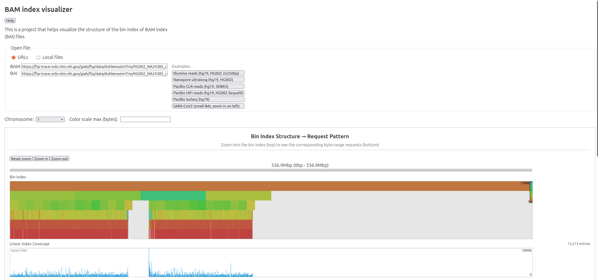

# bam_index_visualizer

I wanted to see the way that data is requested from BAM files by inspecting
visually what request pattern is generated from querying a BAI file

## Screenshot

## Demo

https://cmdcolin.github.io/bam_index_visualizer
